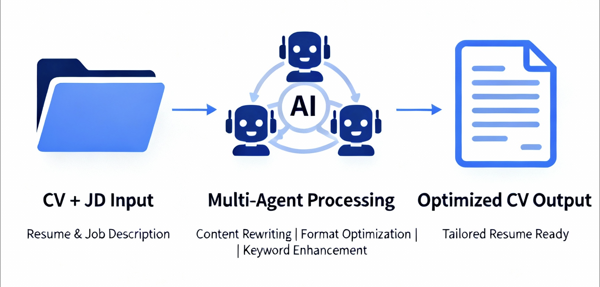
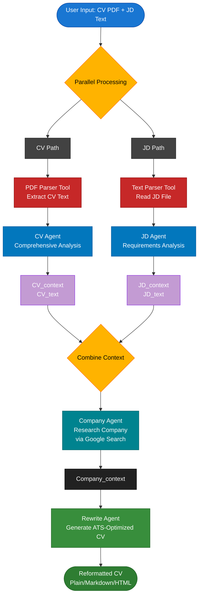

# CV Rewriter Multi-Agent


A multi-agent system built with Google ADK (Agent Development Kit) that optimizes CVs to match job descriptions and maximize ATS (Applicant Tracking System) scores.

## Features
- **Multi-Agent Architecture**: Uses specialized agents **parallelly** and **sequentially** for different tasks:
  - CV Agent: Analyzes candidate profile and skills
  - JD Agent: Analyzes job requirements
  - Company Agent: Researches company information
  - Rewrite Agent: Optimizes CV for ATS
- **PDF and .txt Parsing Tool**: Extracts text from CV PDFs using Apache Tika and text from the txt file.
- **Built-In google_search Tool**: Using google_search tool to assist Company Agent to find out about the company.
- **Context Sharing**: Agents share information through shared context state
- **Sessions & Memory**: Memory is shared across all the sessions using InMemorySessionService() and InMemoryMemoryService()
- **Modular OOP Design**: Clean, maintainable architecture

## Architecture
```
CVFormatter/
├── cv_formatter/
│   ├── __init__.py
│   ├── config.py                 # Configuration & .env loading
│   ├── main.py                   # CLI entry point
│   ├── orchestrator.py           # Workflow orchestration
│   ├── parsers/
│   │   ├── __init__.py
│   │   ├── pdf_parser.py         # PDF text extraction
│   │   └── text_parser.py        # Text file reading
│   └── agents/
│       ├── __init__.py
│       ├── pdf_parser_agent.py   # CV extraction agent
│       ├── txt_parser_agent.py   # JD extraction agent
│       ├── cv_agent.py           # CV analysis agent
│       ├── jd_agent.py           # JD analysis agent
│       ├── company_agent.py      # Company research agent
│       └── rewrite_agent.py      # CV optimization agent
├── pyproject.toml                # Pixi project configuration
├── .env.example                  # Environment variables template
├── .gitignore
└── README.md
```

## Workflow Overview


## How It Works
### Agents
1. **CV Sequential Agent**:
   - PDF Parser tool extracts text from CV
   - CV Agent analyzes candidate profile

2. **JD Sequential Agent**:   
   - Text Parser tool reads job description
   - JD Agent analyzes job requirements

3. **Company Agent**:   
   - Uses google_search tool to research the company
   - Gathers vision, culture, and goals

4. **Rewrite Agent**:   
   - Combines all analyses
   - Generates ATS-optimized CV
   - Maintains authenticity

### Context Variables
Agents share data through context state:
- `CV_text`: Raw CV text
- `CV_context`: CV analysis
- `JD_text`: Raw JD text
- `JD_context`: JD analysis
- `Company_context`: Company research
- `Reformatted_CV`: Final optimized CV

### The system will:
1. Parse your CV PDF and extract text
2. Parse the job description text file
3. Analyze your CV content (skills, experience, keywords)
4. Analyze the JD requirements
5. Research the hiring company using the google_search tool
6. Generate an optimized CV
  
**Key Components:**
- **Parallel Processing**: CV and JD are processed simultaneously for efficiency
- **Context Sharing**: All agents share state through context variables (`CV_text`, `JD_context`, etc.)
- **Sequential Workflow**: Company research → Final CV rewrite happens after initial processing
- **Custom and Built-In Tools**: Use of built-in google_search tool and custom tools like PDF and .txt parser
- **Sessions and Memory**: Memory management for retrieving conversation history and state
- **Output Formats**: Supports plain text, Markdown, and HTML output

## Prerequisites
- Python 3.14+
- [Pixi](https://pixi.sh/) package manager
- Google API key with Generative AI access

## Installation
1. **Clone or navigate to the project**:
   
   ```bash
   cd ~/PycharmProjects/CVFormatter
   ```

2. **Install dependencies with Pixi**:
   
   ```bash
   pixi install
   ```

3. **Configure environment variables**:
   
   ```bash
   vim .env
   # Edit .env and add your Google API key
   ```

4. **Set your Google API key in `.env`**:
   
   ```
   GOOGLE_API_KEY=your_actual_api_key_here
   ```

5. **(Optional) Configure model**:
   
   By default, the system uses `gemini-2.5-flash`. You can change this in `.env`:
   
   ```
   MODEL_NAME=gemini-1.5-pro
   ```
   
   Supported models: `gemini-2.5-flash`, `gemini-1.5-pro`, `gemini-1.5-flash`, etc.

## Usage

### Basic Usage
```bash
pixi run python -m cv_formatter.main <cv_pdf_path> <jd_txt_path> [OPTIONS]
```
### Command-Line Options

- `cv_pdf_path`: Path to your CV PDF file (required)
- `jd_txt_path`: Path to the Job Description text file (required)
- `-o, --output FILE`: Save output to file (if not specified, prints to terminal)
- `-f, --format FORMAT`: Output format: `plain`, `markdown`, or `html` (default: plain)
- `-q, --quiet`: Suppress progress messages, only show final output
- `-h, --help`: Show help message

### Examples

**1. Print to terminal (default):**
```bash
pixi run python -m cv_formatter.main cv.pdf jd.txt
```

**2. Save to file:**
```bash
pixi run python -m cv_formatter.main cv.pdf jd.txt -o reformatted_cv.txt
```

**3. Save as Markdown:**
```bash
pixi run python -m cv_formatter.main cv.pdf jd.txt -o cv.md -f markdown
```

**4. Save as HTML:**
```bash
pixi run python -m cv_formatter.main cv.pdf jd.txt -o cv.html -f html
```

**5. Quiet mode (minimal output):**
```bash
pixi run python -m cv_formatter.main cv.pdf jd.txt -o output.txt -q
```

### Output Formats

**Plain Text** (`-f plain`)

- Clean, ATS-friendly plain text format
- Best for copy-pasting into application forms
- Default format

**Markdown** (`-f markdown`)

- Formatted with Markdown headers and structure
- Includes metadata (generation timestamp)
- Great for GitHub, documentation tools, or converting to other formats

**HTML** (`-f html`)

- Professional HTML document with CSS styling
- Print-ready with @media print styles
- Can be opened directly in web browsers
- Styled with clean, professional formatting

### Expected Output
Generates a new fine-tuned CV such that it:
   - Matches job requirements
   - Includes relevant keywords
   - Aligns with company culture
   - Maximizes ATS score

## Configuration

The application can be configured via the `.env` file:

### Required Configuration

- `GOOGLE_API_KEY`: Your Google API key for Generative AI access

### Optional Configuration

- `MODEL_NAME`: Gemini model to use (default: `gemini-2.5-flash`)
  - Options: `gemini-2.5-flash`, `gemini-1.5-pro`, `gemini-1.5-flash`
  - All agents will use the same model for consistency
- `APP_NAME`: Application name (default: `CVFormatter`)
- `USER_ID`: User identifier (default: `default_user`)

### Example `.env` File

```bash
# Required
GOOGLE_API_KEY=AIza...your_actual_key_here

# Optional
MODEL_NAME=gemini-2.5-flash
APP_NAME=CVFormatter
USER_ID=default_user
```

## Development

### Project Structure

The project follows clean OOP principles:

- **Parsers**: Utility classes for file parsing
- **Agents**: Individual agent implementations wrapping Google ADK LlmAgent
- **Orchestrator**: Workflow management and agent coordination
- **Config**: Centralized configuration management

### Adding New Agents

1. Create a new agent class in `cv_formatter/agents/`
2. Implement the agent logic
3. Add to `agents/__init__.py`
4. Update orchestrator to include the new agent

## Dependencies

- `google-genai`: Google Generative AI SDK
- `python-dotenv`: Environment variable management
- `tika`: PDF text extraction

## License

MIT

## Contributing

Contributions welcome! Please follow the existing code structure and OOP patterns.
